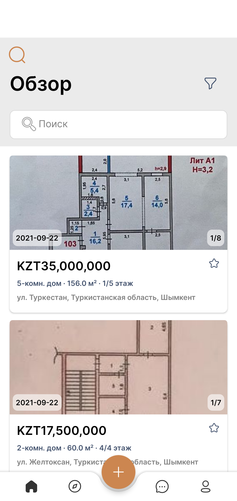
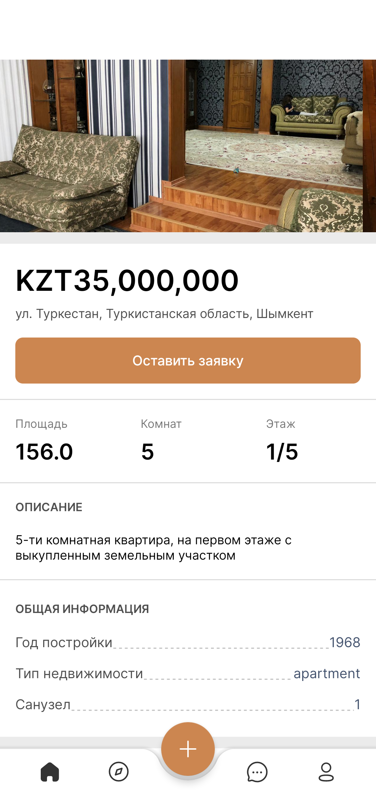

# Baspana App

Android application that allows the user to look for houses, apartments, cottages, and other types of real estate for any taste. 

## What's it used for?

The app is useful for:

- buying any type of real state at preferable price
- selling your real estate by placing an advert in the app (yet to be implemented)
- chatting with the salesman/customer about the advert (yet to be implemented)

## Stack

**Language:** Kotlin

**Framework:** Native Android UI

* **Android Jetpack** architecture components were used

## Libraries
- [Glide](https://github.com/bumptech/glide)
- [Retrofit](https://square.github.io/retrofit/), [okhttp](https://square.github.io/okhttp/)
- [Moshi](https://github.com/square/moshi)

## Demo

## Screenshots
Authorization | OTP authentication | Registration | Home page
--- | --- | --- | --- 
 |  |  | 

Overview | Chats | Profile | Advert details
--- | --- | --- | --- 
 |  |  | 
